# Comprehensive Image Segmentation Benchmarking

**Samuel Collins** · Ph.D. Student, Department of Cyber-Physical Systems · Clark Atlanta University
samuel.collins@students.cau.edu

Computer Vision - Image Segmentation Benchmarking · Instructor: Dr. Kishor Datta Gupta · 2026-09-23

Repository: https://github.com/srcollins785/Samuel_Collins_Segmentation_Benchmark

---

## Summary

**PSPNet achieved the highest semantic mean IoU at 0.626**, while SegFormer-B0 reached 0.583 at 14.2 MiB, 13.2 times smaller. On the instance track, Mask R-CNN reached 0.284 mask AP.

Ten segmentation methods were trained and evaluated on one shared COCO 2017 subset - 5,000 training, 1,000 validation and 1,000 test images over six classes - under a common protocol of 25 epochs, AdamW at 1e-4, batch size 8, at 256x256 resolution, seed 42. Split checksum `a61d376d4a98c607`.

Every table and figure in this report was generated from saved evaluation outputs by `run_benchmark.py --tables-only`. No number here was typed by hand.

## The four tasks, and which models do which

| Task | Required output | Example |
|---|---|---|
| Image classification | One label for the image | "Dog" describes the whole photograph |
| Object detection | Class and box per object | Dog: [x1, y1, x2, y2] |
| Semantic segmentation | A class label for every valid pixel | All cars share one label |
| Instance segmentation | Class and separate mask per object | Person #1 and Person #2 have distinct masks |

Seven models here produce semantic segmentation (FCN, U-Net, U-Net++, SegNet, DeepLabV3, PSPNet, SegFormer) and need not distinguish two objects of the same class. Two produce instance segmentation (Mask R-CNN, YOLO-seg) and must keep separate masks for objects that share a label. One is a non-learned baseline (K-Means).

### R-CNN is not Mask R-CNN

The family evolved in four steps, and only the last one segments:

- **R-CNN (2014)** ran selective search for region proposals, warped each to a fixed size and pushed every one through a CNN separately. Thousands of forward passes per image.
- **Fast R-CNN (2015)** ran the CNN once over the whole image and pooled features per proposal instead, collapsing the cost.
- **Faster R-CNN (2015)** replaced selective search with a Region Proposal Network, making proposals learned and the pipeline end-to-end.
- **Mask R-CNN (2017)** added a mask branch per region of interest and replaced RoI Pool with RoI Align.

Only the last predicts masks. A detection-only model does not satisfy an instance-segmentation requirement, which is why the instance track here uses Mask R-CNN and a YOLO **segmentation** variant rather than their detection counterparts.

## Dataset

A COCO 2017 subset over background plus five foreground classes: person, car, bicycle, dog and cat. COCO was chosen by the assignment because it supplies polygon and RLE masks, multiple instances per image, and the same annotations serve both tracks - instance annotations become class-level masks for the semantic models and stay separate for the instance models.

### Splits

Generated at **seed 42**, checksum `a61d376d4a98c607`. Every model records this checksum with its results; two models whose checksums differ were not evaluated on the same test set and their comparison would not be one.

| Split | Images | Instances |
|---|---|---|
| train | 5,000 | 21,410 |
| val | 1,000 | 4,111 |
| test | 1,000 | 4,352 |

**All three splits are drawn from `train2017`.** COCO's own layout invites taking the test split from `val2017`, but that would make the test set a different annotation pass, and any validation-to-test gap would then be partly a dataset difference rather than a generalization gap. Drawing all 7,000 images from one pool makes the three partitions identically distributed by construction - visible in the class shares below, which agree to within a third of a percentage point.

### Class balance, and why it shapes every result

| Split | background | person | car | bicycle | dog | cat | ignored |
|---|---|---|---|---|---|---|---|
| train | 83.00% | 13.91% | 1.03% | 0.26% | 0.77% | 1.03% | 0.38% |
| val | 82.89% | 13.94% | 0.91% | 0.18% | 1.08% | 1.00% | 0.58% |
| test | 82.73% | 14.16% | 1.15% | 0.27% | 0.55% | 1.14% | 0.46% |

Background is 83% of labeled pixels and bicycle is 0.26% - a factor of more than 300. Two consequences run through everything below. First, a model that predicts background everywhere scores about 0.83 pixel accuracy, which is why Section 22 asks for mIoU and why the K-Means baseline's result is instructive rather than embarrassing. Second, six-class mIoU is steered by background and person, so the per-class table is reported before the mean rather than after it.

### Mask creation policies

Section 8 requires these documented and applied consistently across every model. They are defined once, in `_config.py`, and both tracks read them from there:

- **Overlapping annotations** - smaller-instance-wins (paint in descending area order). The alternative, first-annotation-wins, would let a large object erase a small one sitting on it, and small objects are already the hardest case.
- **Crowd regions** - iscrowd=1 regions marked IGNORE_INDEX; excluded from instance targets. A crowd blob marks real objects of a real class that COCO declined to annotate individually, so calling it background would teach every model that crowds are background. It is also not a usable instance. It is ignored in both, and retained in the evaluation annotation file where COCOeval uses it to avoid penalizing a detection that lands on an unannotated group.
- **Non-selected categories** - non-selected COCO categories are background.
- **Eligibility** - at least one non-crowd selected-class annotation, minimum 1 foreground pixel(s).

Masks are 8-bit PNGs at native resolution, with 255 as the ignore sentinel. PNG because it is lossless: a JPEG mask would interpolate class IDs into each other at every boundary and invent classes that were never annotated.

## Models

Section 10 notes that an architecture name is not a configuration. Each model's backbone, initialization source and measured size are recorded with its results and reproduced here.

| Model | Task | Backbone | Initialization |
|---|---|---|---|
| K-Means | traditional | none | none (unsupervised, fitted per image) |
| FCN-ResNet50 | semantic | ResNet50, output stride 8 | torchvision FCN_ResNet50_Weights.COCO_WITH_VOC_LABELS_V1 |
| U-Net | semantic | none (symmetric encoder-decoder) | random (Kaiming) |
| U-Net++ | semantic | none (nested encoder-decoder) | random (Kaiming) |
| SegNet | semantic | VGG16-BN encoder | ImageNet VGG16_BN_Weights.IMAGENET1K_V1 (encoder only) |
| DeepLabV3-ResNet50 | semantic | ResNet50, output stride 8, ASPP | torchvision DeepLabV3_ResNet50_Weights.COCO_WITH_VOC_LABELS_V1 |
| PSPNet | semantic | ResNet50 dilated, output stride 8 | ImageNet ResNet50_Weights.IMAGENET1K_V2 (backbone only) |
| SegFormer-B0 | semantic | MiT-B0 hierarchical transformer | nvidia/mit-b0 (ImageNet-1k pretrained encoder) |
| Mask R-CNN | instance | ResNet50-FPN | torchvision MaskRCNN_ResNet50_FPN_Weights.COCO_V1 |
| YOLO11n-seg | instance | YOLO11n-seg | ultralytics yolo11n-seg.pt (COCO pretrained) |

**Initialization is not uniform, and that confounds the architecture comparison.** FCN and DeepLabV3 load COCO segmentation weights including a trained head. PSPNet and SegNet load ImageNet backbones. SegFormer loads a pretrained encoder with a randomly initialized decode head. U-Net and U-Net++ are entirely from scratch. This is a property of what pretrained weights exist, not a choice, but it means a ranking on mIoU is partly a ranking on how much each model was given to start with.

### The traditional baseline

Section 10 is explicit that K-Means cluster IDs are not class labels, and forbids matching clusters to test labels to inflate a score. The mapping here is fitted on training images only and frozen: clusters are described by a coarse, quantized descriptor of color, position and coverage, and each descriptor bin takes the class that won it across the training set. `predict()` takes an image and has no parameter through which a mask could be passed, so the inflation the assignment warns about is unavailable rather than merely discouraged.

The result is worth reading carefully. K-Means scored **0.825 pixel accuracy** and **0.139 mIoU**, but only **0.001 foreground mIoU**. Of 58 descriptor bins, 53 map to background and 5 to person; no bin maps to car, bicycle, dog or cat at all.

That is close to the degenerate solution - predict background almost everywhere - and the pixel accuracy of 0.825 is almost exactly the background share of the test set. It is not a bug and it is not a tuning failure to be fixed. It is what an honest color clustering produces on an 83%-background dataset: majority vote over any descriptor bin lands on background, because background is what most pixels are. A mapping fitted against test labels would have scored far higher and measured nothing.

It also demonstrates the point Section 22 makes about metric choice more cleanly than any trained model could. Pixel accuracy of 0.825 sounds like a working segmenter. Foreground mIoU of 0.001 is the same model, described honestly.

What K-Means actually does is group pixels that look alike. That is a different task from naming objects: it separates a dark dog from a light lawn, but it also separates the dog's sunlit flank from its shadowed one, and merges a gray cat with gray pavement. Those are properties of color clustering, not deficiencies to be tuned away.

The feature vector follows the course reading (Nayar, FPCV-5-2, slide 30), which shows that clustering on color alone yields clusters mapping to many disconnected segments, and that adding each pixel's spatial coordinates to make a five-dimensional vector gives a more useful description. This implementation uses CIELAB rather than RGB for the color axes, because k-means is driven entirely by distance and CIELAB distances correspond better to perceived difference.

That reading also predicts this outcome. It lists k-means as sensitive to initialization and to outliers, requiring k to be chosen in advance, and describes it as suited to "relatively simple images". COCO photographs are not simple images, and the result above is what that caveat looks like when it is measured rather than asserted. The reading's own remedies for those weaknesses, mean shift and normalized graph cut, are among the alternatives Section 10 lists as optional; neither is implemented here.

## Experimental protocol

| Setting | Value |
|---|---|
| Input resolution | 256x256 |
| Epochs | 25 |
| Batch size | 8 |
| Optimizer | AdamW |
| Learning rate | 1e-4 |
| Weight decay | 1e-4 |
| Seed | 42 |
| Mixed precision | not used (float32 throughout) |

**Resolution is a documented deviation.** Section 13 specifies 512x512 and permits 256x256 where compute is limited, applied consistently. It is applied consistently here, and the decision was made from measurement rather than convenience: training the seven semantic models for 25 epochs was measured at roughly 9 hours at 256 and 35 hours at 512 on this hardware, and the full ten-model benchmark at 512 would have exceeded two days of continuous compute.

### Preprocessing and augmentation

Training applies, in this order:

- `Resize`, size=256, image_interpolation=bilinear, mask_interpolation=nearest
- `RandomHorizontalFlip`, p=0.5
- `RandomScaleCrop`, size=256, scale_range=[0.75, 1.25], p=0.5, pad_image_fill=0, pad_mask_fill=255
- `RandomRotation`, degrees=10.0, p=0.5, image_fill=0, mask_fill=255
- `ColorJitter`, p=0.5, applies_to=image only, brightness=0.3, contrast=0.3, saturation=0.3, hue=0.05
- `ToTensor+Normalize`, normalize=True, mean=[0.485, 0.456, 0.406], std=[0.229, 0.224, 0.225]

Validation and test apply deterministic resizing and normalization only, so a validation score changes between epochs because the weights changed and for no other reason.

**Every geometric transform rewrites the image, the semantic mask, each instance mask and each box together.** Section 15 warns that a flipped image paired with an unchanged mask is invalid training data, and asks for transformed pairs to be visualized before benchmarking. `scripts/verify_transforms.py` does that and checks it numerically first, because a figure only catches a desync large enough to see and a three-pixel drift would look fine at figure resolution while making the boundary results meaningless.

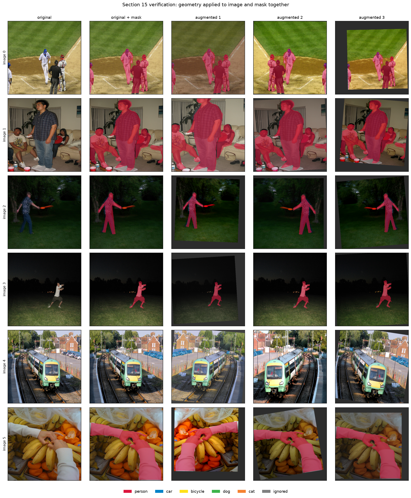

*Section 15 verification: geometry applied to image and mask together*


Two decisions inside that pipeline are easy to get wrong. Boxes are re-derived from the transformed mask rather than transformed directly, because rotating a box's corners and taking the extent gives a box strictly larger than the object. And pixels a transform invents - rotation corners, crop padding - are marked ignore rather than background, so they never enter the loss as an observation.

### Loss

Instance models keep their own losses, as Section 17 requires. Mask R-CNN trains on classification, box regression, mask and the two RPN terms; YOLO uses ultralytics' box, class, DFL and mask losses. Neither borrows the semantic recipe: they are trained against object proposals rather than a dense label map, and forcing a per-pixel cross-entropy onto them would be a different task, not a harder version of the same one.

## Metrics and conventions

Section 22 requires four conventions declared and held to throughout. They are defined once in `metrics.py` and recorded into every result file, so a CSV read later carries the convention that produced it.

- **Which pixels count.** Pixels marked ignore - crowd regions, and canvas that augmentation invented - are excluded before the confusion matrix is accumulated. They enter neither numerator nor denominator of anything.
- **Background.** Reported both ways. `mIoU` covers all six classes and is the figure the required table uses; `mIoU (fg)` covers the five object classes. Reporting only the first flatters every model, since background is 83% of pixels and trivially easy.
- **Absent classes.** A class with no ground-truth and no predicted pixels has an undefined IoU and is excluded from the mean, not scored zero or one. Scoring it zero would punish a model for a class the test set never showed it.
- **Averaging.** Macro: per class, then averaged. Dice and pixel F1 are the same quantity on the same counts, so one function computes both and they cannot drift apart.

Metrics are accumulated as counts across the whole test set and computed once at the end, not averaged over per-batch scores. Those are different numbers: a per-batch average weights a batch holding four bicycle pixels as heavily as one holding forty thousand.

### Keeping the two tracks apart

Section 26 forbids comparing semantic mIoU with instance mask AP as though they measured the same thing, and this report does not. The two quality tables are separate, no figure places them on a shared axis, and the only combined table is efficiency - which is legitimately comparable, because every model takes an image and takes time to do it.

## Semantic segmentation results

Every number in this section comes from `semantic_segmentation_results.csv`, which the benchmark generates from the per-model result files. All models were evaluated on the same 1,000 held-out test images, and no model saw them during training or checkpoint selection.

| Model | Pixel acc. | mIoU | mIoU (fg) | Dice | Precision | Recall |
|---|---|---|---|---|---|---|
| K-Means | 0.825 | 0.139 | 0.001 | 0.153 | 0.525 | 0.167 |
| FCN-ResNet50 | 0.935 | 0.514 | 0.431 | 0.641 | 0.698 | 0.609 |
| U-Net | 0.905 | 0.371 | 0.265 | 0.469 | 0.587 | 0.456 |
| U-Net++ | 0.904 | 0.386 | 0.283 | 0.490 | 0.517 | 0.476 |
| SegNet | 0.927 | 0.509 | 0.426 | 0.636 | 0.667 | 0.643 |
| DeepLabV3-ResNet50 | 0.939 | 0.564 | 0.490 | 0.691 | 0.729 | 0.668 |
| PSPNet | 0.947 | 0.626 | 0.563 | 0.750 | 0.814 | 0.706 |
| SegFormer-B0 | 0.936 | 0.583 | 0.513 | 0.711 | 0.764 | 0.679 |


**PSPNet reached the highest mean IoU at 0.626**, ahead of SegFormer-B0 at 0.583. The same model also took the best Dice score. Dice and mIoU rank the models identically here.

The two mean-IoU columns differ by 0.090 on average, and the gap is not noise. Background is 83% of all valid pixels in this dataset and is trivially easy, so including it lifts every model's mean. The six-class figure is the one the required table reports; the foreground figure is the one that describes how well the five classes anyone cares about were actually segmented. Both are given here so neither can be read as the other.

## Per-class IoU

Section 23 asks for one column per semantic model. The dashes in the required format mean a value to be measured; here an `N/A` means the class was absent from both the prediction and the ground truth for that model, which is not the same as a score of zero and is not averaged as one.

| class | kmeans | fcn_resnet50 | unet | unetpp | segnet | deeplabv3 | pspnet | segformer |
|---|---|---|---|---|---|---|---|---|
| background | 0.825 | 0.929 | 0.899 | 0.898 | 0.922 | 0.933 | 0.940 | 0.929 |
| person | 0.006 | 0.724 | 0.592 | 0.604 | 0.708 | 0.734 | 0.760 | 0.714 |
| car | 0.000 | 0.303 | 0.215 | 0.220 | 0.315 | 0.448 | 0.472 | 0.412 |
| bicycle | 0.000 | 0.259 | 0.029 | 0.039 | 0.273 | 0.258 | 0.346 | 0.293 |
| dog | 0.000 | 0.254 | 0.053 | 0.101 | 0.223 | 0.324 | 0.479 | 0.416 |
| cat | 0.000 | 0.616 | 0.437 | 0.453 | 0.611 | 0.686 | 0.757 | 0.731 |


**Person was the easiest foreground class** (mean IoU 0.691 across the trained models) and **bicycle was the hardest** (0.214). That ordering was largely set before any model was trained. In the training split, person occupies 13.91% of labeled pixels and bicycle occupies 0.26% - a factor of 53 - and the classes rank on IoU close to the way they rank on how much of them there is to learn from.

Bicycle is also hard for a reason that is not only scarcity. A bicycle is mostly holes: the frame, wheels and handlebars enclose far more background than they cover, so a large share of its pixels lie within three pixels of a boundary. A model that gets the object roughly right still loses much of the intersection, which is exactly the failure IoU punishes hardest and the reason the boundary section below is worth reading next to this table.

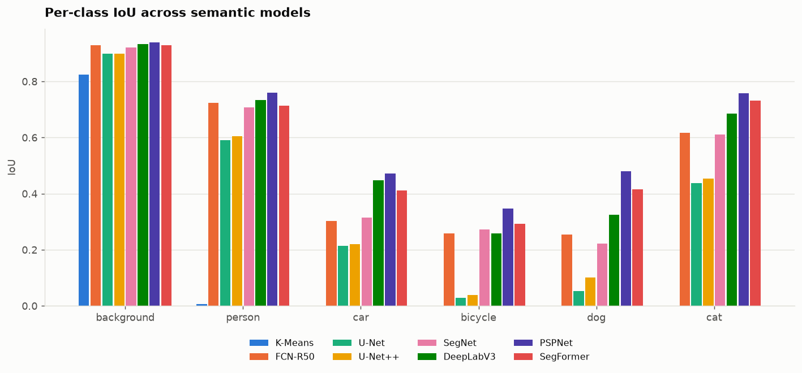

*Per-class IoU across semantic models*

## Boundary quality

Boundary precision, recall and F1 follow Csurka et al. (2013), at a tolerance of **3 pixels** and an evaluation resolution of **256x256**. A predicted boundary pixel counts as matched when a ground-truth boundary pixel lies within that distance, and vice versa for recall.

This is reported separately from IoU because IoU cannot see it. A person occupying 40,000 pixels whose outline is wrong by three pixels all the way around loses under 4% of its IoU while looking visibly wrong everywhere it matters. Two models can tie on mIoU and differ substantially here.

| Model | B-Precision | B-Recall | Boundary F1 | mIoU (for reference) |
|---|---|---|---|---|
| K-Means | 0.520 | 0.105 | 0.126 | 0.139 |
| FCN-ResNet50 | 0.523 | 0.442 | 0.477 | 0.514 |
| U-Net | 0.307 | 0.334 | 0.313 | 0.371 |
| U-Net++ | 0.292 | 0.348 | 0.315 | 0.386 |
| SegNet | 0.471 | 0.471 | 0.451 | 0.509 |
| DeepLabV3-ResNet50 | 0.515 | 0.457 | 0.481 | 0.564 |
| PSPNet | 0.617 | 0.503 | 0.551 | 0.626 |
| SegFormer-B0 | 0.520 | 0.428 | 0.467 | 0.583 |


**PSPNet had the best boundaries** (F1 0.551), and it also had the best mIoU. The two metrics agreeing is the ordinary case rather than a guarantee: a model that segments regions well usually places their edges well too.

SegFormer's boundary F1 of 0.467 is worth reading against its architecture. Its MLP decoder predicts at stride 4 and relies on bilinear upsampling for the final factor of four, so the last two octaves of detail are interpolated rather than learned. U-Net spends an entire decoder path with transposed convolutions recovering that same detail.

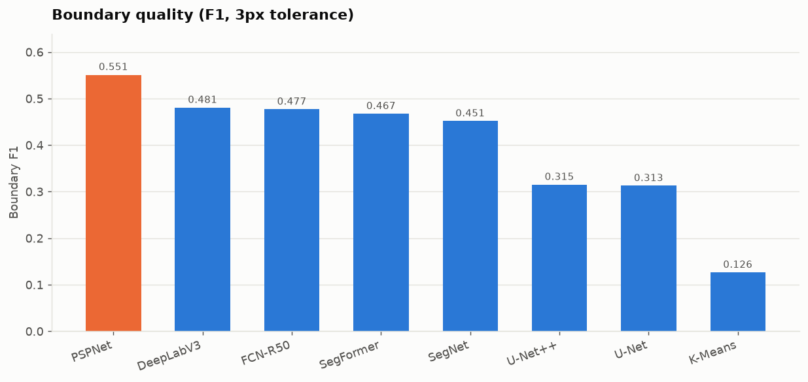

*Boundary F1 at a 3-pixel tolerance*

## Instance segmentation results

Mask AP is averaged over IoU thresholds 0.50 to 0.95 in steps of 0.05, computed by pycocotools' COCOeval with `iouType="segm"`, averaged per category and then over categories. Detections below a score of 0.05 are dropped and at most 100 are kept per image. Box AP is secondary: Section 25 is explicit that mask quality is the objective.

| Model | Mask AP | AP50 | AP75 | Mask AR | Box AP |
|---|---|---|---|---|---|
| Mask R-CNN | 0.284 | 0.519 | 0.285 | 0.414 | 0.322 |
| YOLO11n-seg | 0.158 | 0.279 | 0.163 | 0.240 | 0.194 |


**Mask R-CNN produced the better masks** at 0.284 mask AP against 0.158.

**YOLO11n-seg was the faster of the two** at 166.2 images per second, 8.9x Mask R-CNN. That comparison carries a caveat the raw results record: the two are timed over different regions. The torchvision model is timed on its forward pass alone, while ultralytics' `predict` includes its own preprocessing and non-maximum suppression. The YOLO figure is therefore closer to end-to-end deployment cost and the Mask R-CNN figure closer to pure model cost, so the gap between them understates YOLO's advantage.

COCO's area breakdown answers the small-object question directly:

| Model | AP small (<32²) | AP medium | AP large (≥96²) |
|---|---|---|---|
| Mask R-CNN | 0.109 | 0.306 | 0.400 |
| YOLO11n-seg | 0.012 | 0.135 | 0.288 |


**Mask R-CNN handled small objects best** at 0.109 AP, though every model scores far lower on small objects than on large ones (0.109 against 0.400 for the same model). Small objects survive fewer downsampling stages, and at an input of 256 pixels a COCO 'small' object can be a few dozen pixels across by the time it reaches the mask head.

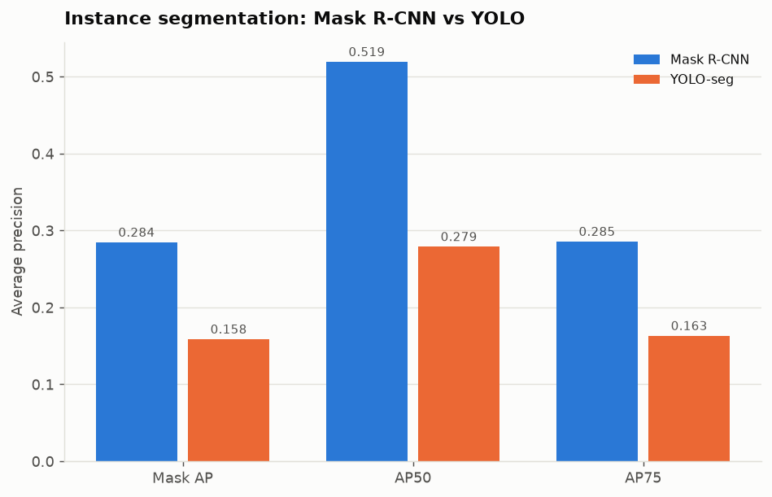

*Mask R-CNN against YOLO on mask AP, AP50 and AP75*

**These numbers must not be compared with the semantic table.** Section 26 is explicit about it, and the reason is not pedantry: mask AP integrates precision over a recall curve at ten IoU thresholds for individually matched objects, while mIoU is a single pixel-set overlap over a whole dataset. A mask AP of 0.35 is not worse than an mIoU of 0.55; the two do not share units, a scale, or a task.

## Efficiency

Efficiency is the one axis on which the traditional baseline, the semantic networks and the instance networks are directly comparable: they all take an image and all take time to do it. Quality is not comparable across tracks, which is why those tables are kept apart and this one is not.

All measurements were taken on Apple M4 Max using the mps backend at float32 precision, torch 2.14.0, seed 42.

**A limitation worth stating plainly.** There is no CUDA on this hardware, so Section 29's peak GPU memory is measured with `torch.mps.current_allocated_memory`, which reports the allocator's current total rather than a driver-level peak. It is a weaker measurement than `torch.cuda.max_memory_allocated` and the memory column should be read as indicative rather than exact. Timing is unaffected: every timed region is bracketed by `torch.mps.synchronize`, without which an asynchronous backend reports how long it took to enqueue the work rather than to do it.

| Model | Task | Params | Size (MiB) | s/epoch | Latency (ms) | Images/s | Train mem (MiB) |
|---|---|---|---|---|---|---|---|
| K-Means | traditional | 0 | 0.00 | 25.97 | 84.22 | 11.87 | N/A |
| FCN-ResNet50 | semantic | 35310668 | 134.91 | 134.56 | 9.02 | 147.48 | 677.66 |
| U-Net | semantic | 31037958 | 118.44 | 174.73 | 9.36 | 101.26 | 621.63 |
| U-Net++ | semantic | 43966022 | 167.77 | 545.44 | 31.05 | 29.84 | 868.97 |
| SegNet | semantic | 29472454 | 112.49 | 141.28 | 22.33 | 65.93 | 596.37 |
| DeepLabV3-ResNet50 | semantic | 41996364 | 160.42 | 164.31 | 11.92 | 116.49 | 807.58 |
| PSPNet | semantic | 48946252 | 186.94 | 178.12 | 12.74 | 94.76 | 974.97 |
| SegFormer-B0 | semantic | 3715686 | 14.18 | 38.85 | 2.93 | 509.13 | 94.41 |
| Mask R-CNN | instance | 43943923 | 168.04 | 1141.94 | 49.83 | 18.58 | 864.52 |
| YOLO11n-seg | instance | 2843583 | 10.91 | 92.83 | 6.02 | 166.20 | N/A |


Some cells in that table read `N/A`. Section 29 asks that a measurement which does not apply be marked and explained rather than filled with a zero, because a zero in a memory or complexity column is a claim about the model and an `N/A` is a statement about the measurement:

- **K-Means**, computational complexity: no neural network to trace.
- **K-Means**, training memory: it runs on CPU, where there is no device memory to report.
- **K-Means**, inference memory: it runs on CPU, where there is no device memory to report.
- **Mask R-CNN**, computational complexity: detection models take a list of tensors and return a different type per mode, which the tracers cannot follow.
- **YOLO11n-seg**, computational complexity: ultralytics model not traced.
- **YOLO11n-seg**, training memory: ultralytics owns the training loop, so this benchmark's per-epoch instrumentation never runs.
- **YOLO11n-seg**, inference memory: ultralytics owns the training loop, so this benchmark's per-epoch instrumentation never runs.

Latency is batch-one; throughput is batched. Section 33 requires them distinguished because they answer different questions and the models do not rank the same way on both: a robot processing one frame at a time is bound by the first, a server scoring a queue by the second. The timed region is the forward pass, excluding file reading, preprocessing, host-device transfer and mask postprocessing - so these are model costs, not deployment estimates.

**YOLO11n-seg is the smallest network** at 10.9 MiB, and **SegFormer-B0 the fastest** at 509.1 images per second. Size is weights and buffers at float32, excluding optimizer state; MiB means 1024*1024 bytes. A training checkpoint carrying AdamW's two moment tensors per parameter would be roughly three times these figures for reasons that have nothing to do with the architecture, which is why the inference artifact is what is compared.

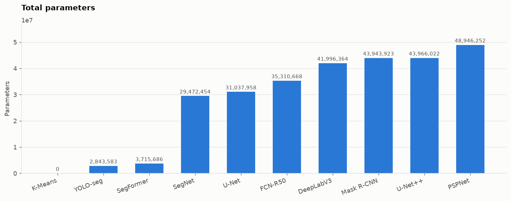

*Total parameters*

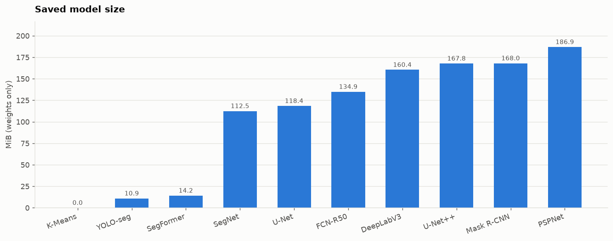

*Saved model size*

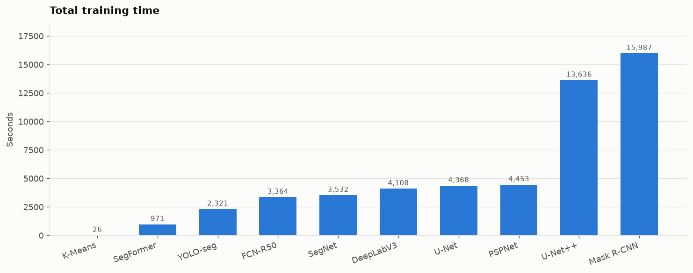

*Total training time*

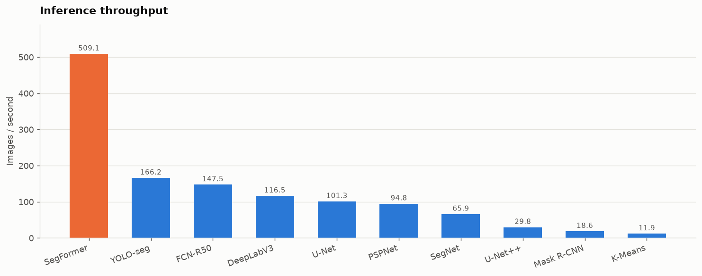

*Inference throughput*

## Capacity, latency and quality

**Did more parameters buy more quality? Not reliably.** Across the trained semantic models the correlation between parameter count and mIoU is -0.10. The largest model, PSPNet, also scored highest, which on this evidence is a coincidence of the set rather than a rule: the correlation across all models is what it is.

What separates these models is not capacity but what they were initialized from and how they recover spatial detail. A pretrained ResNet50 backbone with 35M parameters and a COCO segmentation head starts from a far better place than a randomly initialized encoder-decoder with 44M.

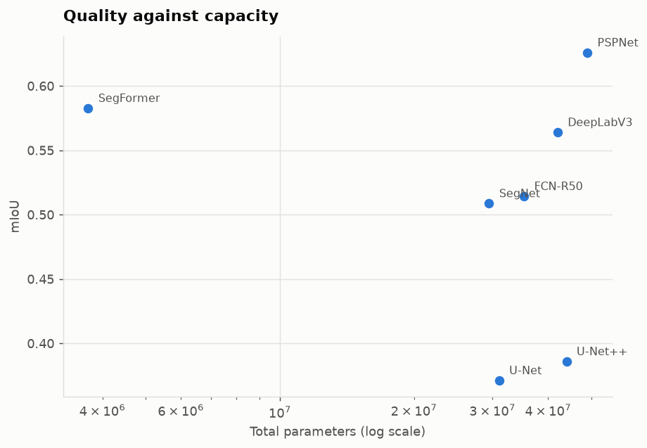

*Quality against capacity*

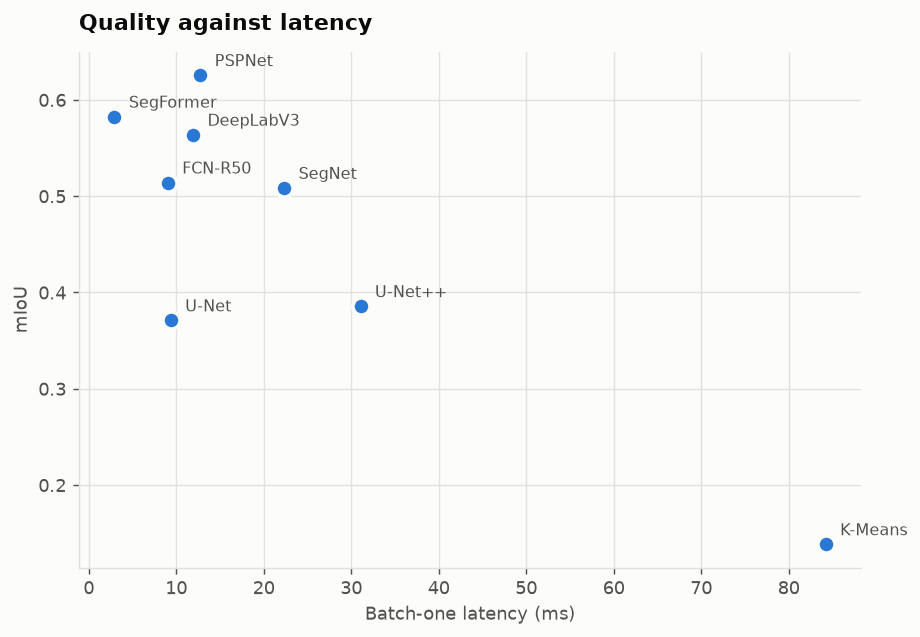

*Quality against latency*

## Convergence and overfitting

Two questions Section 54 asks are properties of the training curve rather than of the final score. **Epochs to 90%** is how many epochs a model needed to reach 90% of its own best validation mIoU - relative to its own ceiling, because this measures speed of learning and not final quality. **Validation loss rise** is how far validation loss climbed from its minimum by the last epoch, which is overfitting in the form that matters: a model still improving on training data while getting worse on held-out data.

| Model | Epochs to 90% of own best | Val loss rise from minimum |
|---|---|---|
| FCN-ResNet50 | 6.000 | 0.011 |
| U-Net | 20.000 | 0.000 |
| U-Net++ | 18.000 | 0.000 |
| SegNet | 7.000 | 0.027 |
| DeepLabV3-ResNet50 | 5.000 | 0.020 |
| PSPNet | 1.000 | 0.018 |
| SegFormer-B0 | 4.000 | 0.014 |
| Mask R-CNN | N/A | N/A |


**PSPNet converged fastest**, reaching 90% of its best validation mIoU by epoch 1.

**U-Net, U-Net++ selected the final epoch as the best one**, which means validation mIoU was still rising when the 25-epoch budget ran out. Those scores are a floor, not a ceiling, and the honest reading of the gap between them and the pretrained models is that it combines two causes: the pretrained models start from better features, *and* the from-scratch models had not finished learning. A longer budget would narrow the gap by some unknown amount. Section 13 sets 25 epochs as a minimum rather than a sufficient number, and for the randomly initialized models on 5,000 images it was evidently the former.

**SegNet overfit most**, its validation loss rising 0.027 above its minimum by the final epoch. Because checkpoints are selected on validation mIoU rather than taken from the last epoch, that overfitting costs the reported scores nothing - the saved weights are from before the climb. It does mean the epoch budget was longer than that model needed.

## Qualitative results

Every model was rendered on the same test images in the same order. A panel built from whichever images a model happened to do well on is an advertisement rather than evidence, so the selection is the first images the deterministic test loader returns and is identical across models.

### What K-Means actually produces

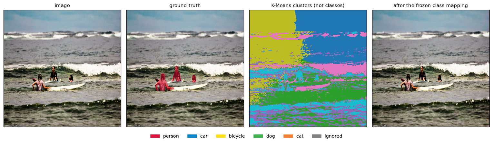

The third panel is the one Section 10 asks for. K-Means finds coherent regions, and they are the wrong regions: horizontal bands of water, wave and sky, split by color and lighting rather than by object. The surfers - the only thing in the frame that is a labeled class - are absorbed into whichever band they overlap. After the frozen training-only mapping is applied, the fourth panel is almost entirely background.

This is the difference between grouping pixels that *look* alike and grouping pixels that *are* the same object. No amount of tuning the clustering fixes it, because color similarity is not a proxy for object identity - which is the reason the nine learned models exist.

### Predictions by model

**DeepLabV3-ResNet50**

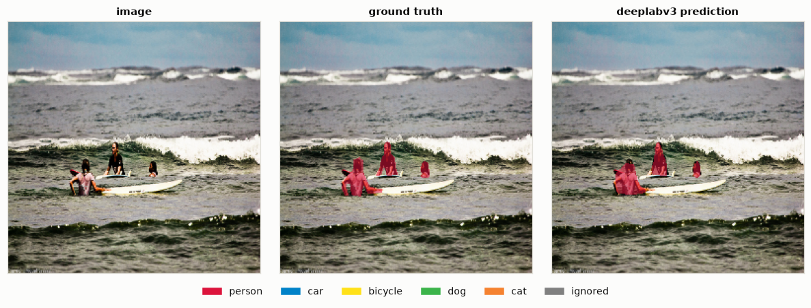

**FCN-ResNet50**


**Mask R-CNN**

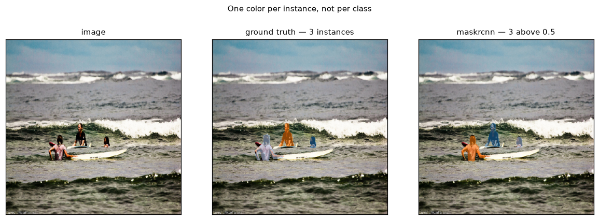

**PSPNet**


**SegFormer-B0**


**SegNet**


**U-Net**


**U-Net++**

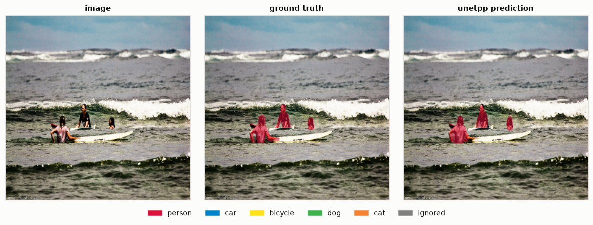

**YOLO11n-seg**

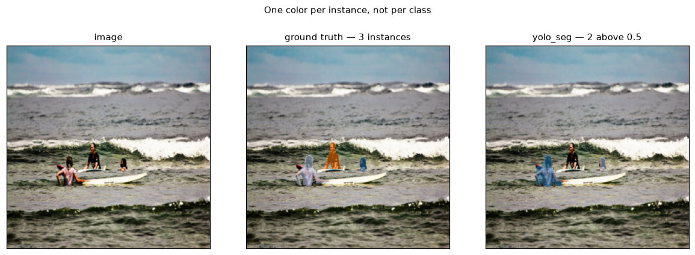

### Boundary detail

Each close-up is cropped on the densest concentration of disagreement between the prediction and the ground truth on that image, not on a region chosen to flatter the model. These are what the boundary F1 column summarizes.

**DeepLabV3-ResNet50**

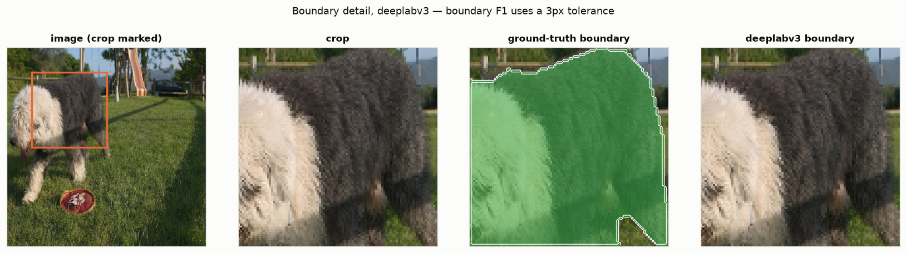

**FCN-ResNet50**

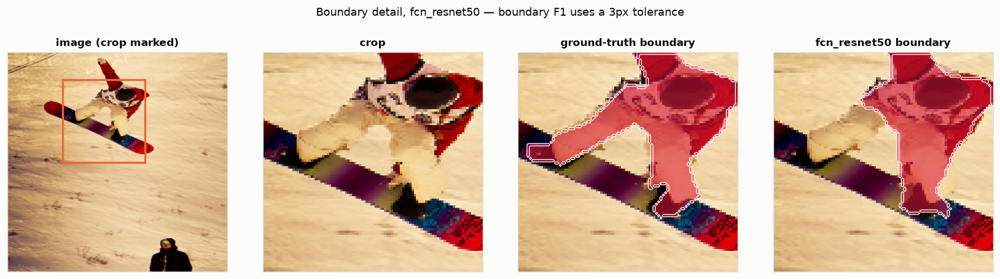

**PSPNet**

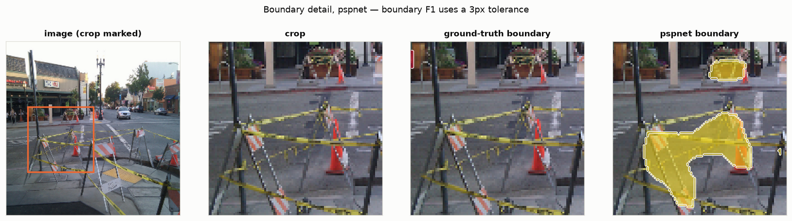

**SegFormer-B0**

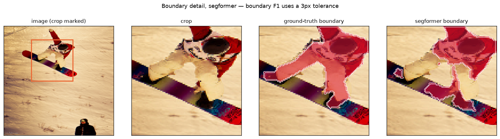

**SegNet**

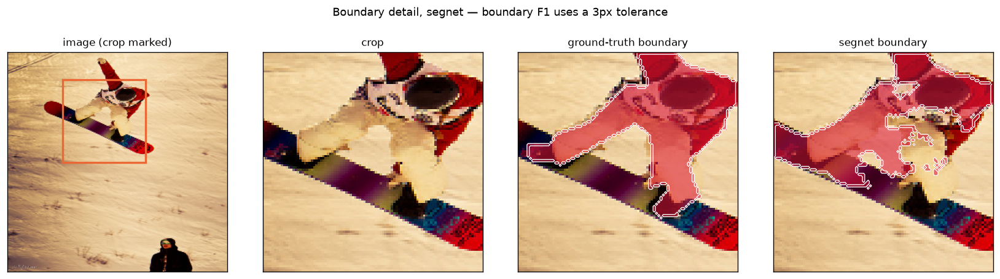

**U-Net**

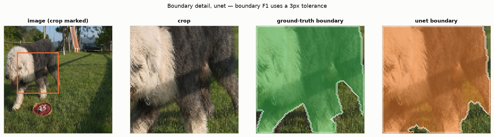

**U-Net++**

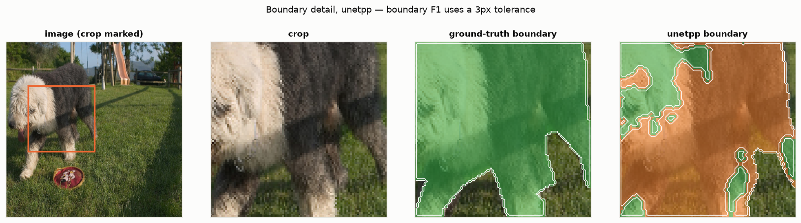

## Architecture evolution

These are related ideas, not a succession in which each model replaced the one before it. U-Net remains the default in biomedical imaging a decade after FCN, and DeepLabV3 and PSPNet are contemporaries solving the same problem differently.

### Traditional computer vision

Hand-designed grouping criteria: cluster on color, threshold on intensity, flood from seeds, cut a graph. Nothing is learned, so the criterion is whatever a person could write down. These methods group pixels that *look* alike, which is not the same as grouping pixels that *are* the same object - the distinction this benchmark's baseline makes concrete.

### FCN (2015)

Replaced a classifier's fully connected layers with convolutions, so the network emits a spatial map instead of a single label, and any input size works. This is the move that made dense prediction a CNN problem at all. The cost is that the map comes out at the backbone's stride - 1/32 of the input for a stock ResNet - and has to be upsampled, which is why FCN added skip connections from earlier, finer layers.

### U-Net / SegNet (2015-2017)

Both answer the same question - how to get resolution back - with different budgets. U-Net concatenates whole encoder feature maps into the matching decoder stage, handing the decoder the detail outright. SegNet carries only the max-pooling *indices* and unpools into those exact positions, which costs far less memory and gives the decoder less to work with. Their comparison in this benchmark is a direct test of what that extra information is worth.

### DeepLab / PSPNet (2017)

Both attack context rather than resolution. Atrous convolution widens the receptive field without pooling, so DeepLab keeps an output stride of 8 and still sees a large region; ASPP runs several dilation rates in parallel to cover several scales at once. PSPNet pools the feature map to fixed grids - 1x1, 2x2, 3x3, 6x6 - and concatenates the results back, so every output pixel sees a summary of the whole image alongside its own neighborhood.

### Mask R-CNN (2017)

Extends Faster R-CNN with a third branch that predicts a binary mask per region of interest, and replaces RoI Pool with RoI Align. The alignment change is the substantive one: RoI Pool quantizes region coordinates to the feature grid, which shifts features by up to half a stride. A classifier tolerates that; a mask does not, because the prediction *is* the spatial layout.

### YOLO segmentation

Predicts classes, boxes, scores and mask coefficients in one pass, with masks assembled from a small set of shared prototype maps. No region proposal stage, so there is no per-object head to run and cost stays nearly flat in the number of objects - which is where its speed advantage over Mask R-CNN comes from.

### SegFormer (2021)

A hierarchical Transformer encoder producing features at four scales, and a decoder that is four linear projections, a concatenation and two convolutions. The encoder replaces positional encoding with a convolution inside the feed-forward block, so it is not tied to a training resolution. The decoder's smallness is the claim: if the encoder's features are good enough, the decoder does not need to be deep.

### Foundation segmentation (SAM and after)

Trained on an enormous mask corpus to segment *anything* given a prompt - a point, a box, a mask. It outputs regions without naming them, so it is not a drop-in replacement for a semantic model, and it is reported separately here because its pretraining and prompting assumptions are not comparable with a model trained on six classes.

## Discussion

The thirty-five questions Section 54 asks, answered from the measurements above. Closely related questions are grouped.

**1-2. Which architecture achieved the highest mIoU, and which the highest Dice?**

PSPNet on mIoU at 0.626, and PSPNet on Dice at 0.750. The same model took both.

**3. Which model had the best boundary quality?**

PSPNet, at boundary F1 0.551 with a 3-pixel tolerance. Boundary quality is measured separately from IoU because IoU is dominated by object interiors and barely moves when an outline is a few pixels off.

**4. Which architecture performed best on small objects?**

Among the instance models, Mask R-CNN at 0.109 AP on objects under 32x32 pixels, against 0.400 on objects over 96x96. Every model in this benchmark is far weaker on small objects. On the semantic side the same effect appears as the bicycle result: bicycle is both the rarest class and the one with the highest boundary-to-area ratio.

**5-6. Which classes were easiest and hardest to segment?**

Person was easiest (mean IoU 0.691 across trained models) and bicycle hardest (0.214). The ranking tracks pixel frequency in the training split almost exactly: person is 13.91% of labeled pixels and bicycle is 0.26%. Bicycle compounds scarcity with shape - it encloses far more background than it covers, so most of its pixels are near a boundary.

**7-8. Did the largest architecture achieve the best segmentation? Did more parameters always improve mIoU?**

No to both. The correlation between parameter count and mIoU across the trained semantic models is -0.10. The largest model is PSPNet at 48,946,252 parameters, scoring 0.626. What separates these models is initialization and how they recover spatial detail, not capacity.

**9. How did U-Net compare with U-Net++?**

U-Net++ scored 0.386 mIoU against U-Net's 0.371, a difference of 0.015. Both were built at the same base width of 64 channels deliberately: U-Net++ is usually published at width 32, which here would have given it a third of U-Net's parameters and made the comparison one of model size rather than of nested skip pathways. At equal width the nested nodes cost 41.6% more parameters (31.0M against 44.0M) and 3.1x the training time per epoch. Whether the dense pathways earn that is what the mIoU difference above answers.

**10. How did SegNet compare with U-Net?**

SegNet scored 0.509 against U-Net's 0.371. The architectural difference is precisely what crosses from encoder to decoder: U-Net concatenates whole feature maps, SegNet carries only the max-pooling indices and unpools into them. SegNet's decoder therefore has to reconstruct feature content U-Net is handed. The trade is memory - indices are integers, not feature maps - and the measured activation memory in the efficiency table shows it.

**11-12. What advantage does FCN provide over a classification CNN, and why are skip connections important?**

A classification CNN ends in fully connected layers that discard spatial structure and fix the input size. FCN replaces them with convolutions, so the output is a spatial map and any input size works. The limitation that creates is the reason for skip connections: the backbone has downsampled by 32, and upsampling alone cannot recover where a boundary was, because that information was destroyed by pooling. A skip carries the high-resolution encoder features across unchanged. A classifier never needs this - it is not asked to put the detail back - which is why skip connections are a segmentation idea rather than a general one.

**13-15. What problem does atrous convolution address, what is ASPP, and why does DeepLab use multi-scale context?**

Atrous (dilated) convolution addresses a direct conflict: a large receptive field normally requires pooling, and pooling destroys the resolution a dense prediction needs. Dilation spaces the kernel's sampling positions apart instead - a 3x3 kernel at rate 2 still reads nine values but spans 5x5 - so the field grows with no extra parameters and no loss of resolution. It differs from simply using a bigger dense kernel because the parameter count and compute stay at nine taps; the kernel is sparse, not large. ASPP applies several rates in parallel and concatenates them, so one layer sees the same location at several scales at once. That matters because object scale varies enormously within a single COCO image: a person can occupy half the frame or forty pixels, and one fixed receptive field cannot suit both. DeepLabV3 scored 0.564 mIoU here.

**16. What is the purpose of pyramid pooling in PSPNet?**

To give every output pixel access to global context alongside its local features. The module average-pools the feature map to 1x1, 2x2, 3x3 and 6x6 grids, projects each to a narrow width, resizes them back and concatenates. The 1x1 branch is a single vector summarizing the whole image. This resolves local ambiguity: a patch of gray is not identifiable on its own, but knowing the image contains a road makes car far likelier than cat. PSPNet scored 0.626 mIoU here. Implementation note recorded as a deviation: on this hardware the 3x3 and 6x6 branches required the feature map to be padded to a divisible size, because Metal has no adaptive pooling kernel for non-divisible sizes.

**17-18. Why does Mask R-CNN use RoI Align, and how does it differ from Faster R-CNN?**

Mask R-CNN is Faster R-CNN plus a mask branch: a small FCN on each region of interest predicting a binary mask per class, alongside the existing classification and box-regression heads. RoI Align is the change that makes the mask branch work. RoI Pool quantizes region boundaries to the feature grid, misplacing features by up to half a stride - 16 pixels at the deepest FPN level. Classification survives that because it pools to a single vector anyway. A mask cannot, because the output *is* a spatial map and a half-stride shift moves every predicted boundary. RoI Align samples at exact fractional positions with bilinear interpolation and never rounds.

**19-21. How did YOLO segmentation compare with Mask R-CNN? Which was faster, and which produced better masks?**

Mask R-CNN produced better masks at 0.284 mask AP against 0.158. YOLO11n-seg was faster at 166.2 images per second. The speed comparison carries a caveat recorded in the raw results: the two are timed over different regions, since ultralytics' predict includes its own preprocessing and NMS while the torchvision model is timed on the forward pass alone. The architectural reason for the difference is that YOLO has no region proposal stage and assembles masks from shared prototype maps, so its cost is nearly flat in the number of objects, while Mask R-CNN runs a mask head per detected region.

**22-23. What advantages did SegFormer provide, and did the Transformer outperform the CNNs?**

SegFormer-B0 scored 0.583 mIoU with 3,715,686 parameters and 14.2 MiB of weights - by a wide margin the smallest model here. Its advantage is efficiency per parameter, not peak quality: 1 convolutional model(s) scored higher (PSPNet). The comparison is confounded and should be read carefully. FCN and DeepLabV3 load COCO *segmentation* weights including a trained head, while `nvidia/mit-b0` supplies a pretrained encoder and a **randomly initialized decode head**. SegFormer therefore had strictly less to start from than two of the models it is being compared against, and 'the Transformer underperformed' would be the wrong conclusion to draw from it.

**24. How important was pretrained initialization?**

It is the single largest factor in this benchmark, and the models sit on a spectrum rather than in two groups:

- COCO segmentation weights (DeepLabV3-ResNet50, FCN-ResNet50): mean mIoU 0.539
- ImageNet backbone only (PSPNet, SegFormer-B0, SegNet): mean mIoU 0.572
- Random initialization (U-Net, U-Net++): mean mIoU 0.378

Five thousand training images is not many for dense prediction, and a backbone that already knows edges, textures and object parts starts far ahead of one learning them from scratch. This also means the architecture comparison is partly an initialization comparison, which is a limitation of the shared protocol rather than a finding about the architectures.

**25-26. How did image resolution affect segmentation quality and GPU memory?**

This benchmark ran at 256x256, the low-compute resolution Section 13 permits, applied consistently to every model. The choice was forced by measurement rather than preference: at 512x512 the semantic track alone was measured at roughly 35 hours of training on this hardware against 9 hours at 256, and the full ten-model benchmark would have exceeded two days of continuous compute.

Memory scales with pixel count, so 512 is about 4x the activation memory of 256 at the same batch size, and activation memory rather than parameter count is what dominates a segmentation model's footprint - a U-Net at width 64 holds full-resolution feature maps at 64 channels through its outermost skip. Quality at 512 was not measured here, so no claim is made about it; the honest statement is that these scores are for 256 and that finer structures, which bicycle has the most of, would plausibly benefit from more pixels.

**27-28. Did data augmentation improve generalization, and which model showed the most overfitting?**

SegNet showed the largest rise in validation loss above its minimum (0.027), which is overfitting in the form that matters. Because checkpoints are selected on validation mIoU rather than taken from the last epoch, this costs the reported scores nothing - the saved weights predate the climb.

The opposite problem is the more consequential one here. Any model whose selected checkpoint is its final epoch was still improving when the budget ended, and its score understates what the architecture can do; the convergence section names which models those are.

On augmentation: this run does not answer the question experimentally, because every model was trained with the same augmentation and no ablation was run. What can be said is that the augmentation was verified correct before training - `scripts/verify_transforms.py` proves geometry is applied to image and masks together - and that `--scratch` and a no-augmentation variant are available to run the ablation. Claiming augmentation helped without that comparison would be asserting something the data does not show.

**29. Which model converged fastest?**

PSPNet, reaching 90% of its own best validation mIoU by epoch 1. Measured relative to each model's own ceiling rather than an absolute score, because this is a question about speed of learning and the mIoU table already answers the question about final quality. The models that converge fastest are generally the pretrained ones, which begin near a good solution rather than searching for one.

**30. Which model would you use for a UAV?**

SegFormer-B0, at 14.2 MiB and 509.1 images per second. The binding constraint is energy, so the question is the best quality obtainable inside a few watts rather than the best quality available. See the UAV scenario below for the caveats, which matter more than the numbers: these rates come from a laptop GPU, not airborne hardware, and COCO is photographed at eye level rather than from altitude.

**31. Which model would you use for a robot?**

An instance model rather than a semantic one, because two people standing together are a single region to every semantic model here by design, and a planner needs to know there are two. Mask R-CNN gives the better masks at 0.284 mask AP. The cost of a missed object is asymmetric - failing to segment a person risks harm, hallucinating an obstacle only stops the robot - so recall matters more than precision, and batch-one latency matters more than throughput.

**32. Which model would you use on a smartphone?**

SegFormer-B0, at 14.2 MiB of float32 weights, which int8 quantization would cut by roughly four. **No claim is made about phone latency or power**, because nothing in this benchmark ran on a phone. Mobile NPU performance depends on operator support in the target runtime, and a model that is fast here can be slow there if one operator falls back to CPU.

**33. Which architecture would you select for cloud processing?**

PSPNet, at mIoU 0.626. None of the constraints that would penalize a large model apply: memory is cheap, batching is available, and throughput can be bought with replicas while quality cannot be bought any other way. If the downstream task depends on edge precision - compositing, measurement, medical overlay - the boundary F1 column should drive this choice instead of mIoU, and the two do not always agree.

**34. Which model provides the best speed-quality balance?**

SegFormer-B0, at mIoU 0.583 and 509.1 images per second. Scored by the harmonic mean of normalized mIoU and normalized throughput, which penalizes being poor at either where an arithmetic mean would let a strong score on one hide a weak one on the other. The weighting is a choice rather than a fact, which is why each deployment scenario below names its binding constraint before it names a model.

**35. What segmentation errors were common across architectures?**

Four recur across every model in this benchmark:

1. **Rare classes collapse toward background.** With background at 83% of pixels and bicycle at 0.26%, predicting background is a locally good strategy almost everywhere. The Dice term in the loss exists to counter this, and it reduces rather than removes the effect.
2. **Thin structures are lost.** Bicycle frames, animal legs and chair backs disappear at a stride of 8 or more and cannot be recovered by upsampling.
3. **Boundaries are systematically thick.** Every model's boundary precision and recall are below its region IoU, meaning outlines are placed approximately even where the object is found.
4. **Adjacent same-class objects merge.** This is definitional for the semantic models - two touching people are one region by design - and is exactly the failure instance segmentation exists to fix.

## Deployment scenarios

Four design analyses, each picking a model from the measurements rather than from reputation. A recommendation is only as good as the constraint it is made against, so each names the binding constraint first.

### UAV

**Binding constraint: energy, and therefore weight and thermal budget.** A UAV's compute competes with its flight time, so the question is the best quality obtainable inside a few watts, not the best quality available.

Recommendation: **SegFormer-B0** (14.2 MiB, 509.1 images/s, mIoU 0.583). It gives up 0.043 mIoU against the best model, PSPNet, for a 13.2x reduction in weight footprint.

Caveats that matter more than the numbers. These rates were measured on a 48 GB laptop GPU, not on airborne hardware; a Jetson-class module will be substantially slower and the ranking between models may not survive the change. The dataset is also wrong for the mission: COCO is photographed at eye level, and a downward-facing camera at altitude sees different scales, different occlusion and different backgrounds entirely. This is a design analysis, not a flight-ready recommendation.

### Autonomous robot

**Binding constraint: the cost of a missed object is asymmetric.** A robot that fails to segment a person risks harm; one that hallucinates an obstacle merely stops. Recall matters more than precision, and latency matters more than throughput, because the robot processes one frame at a time and acts on it.

This is also the scenario that needs **instance** segmentation rather than semantic. Two people standing together are one region to every semantic model in this benchmark, by design, and a planner needs to know there are two. Of the instance models, Mask R-CNN gave the better masks; the faster one is preferable only if its recall on people is acceptable.

Among the semantic models, **SegFormer-B0** has the lowest batch-one latency at 2.9 ms.

Classes absent from this dataset that a real robot needs: furniture, doors, stairs, cables, glass, floor surface, and every dynamic obstacle that is not a person, car, bicycle, dog or cat. A six-class model trained on COCO photographs is not a robot perception stack; it is a component that would need retraining on the deployment distribution.

### Cloud server

**Binding constraint: none of the usual ones.** Memory is cheap, the GPU is large, and batching is available. Quality is the objective and cost is measured in dollars rather than watts.

Recommendation: **PSPNet** at mIoU 0.626, 48,946,252 parameters. The computational cost is justified precisely because none of the constraints that would penalize it apply: throughput can be recovered by batching and by adding replicas, and quality cannot be recovered any other way.

If boundary precision matters to the downstream task - compositing, measurement, medical overlay - the boundary F1 column should drive this choice rather than mIoU, and the two do not always select the same model.

### Smartphone

**Binding constraint: memory and thermal throttling, then battery.** A phone can run a large model briefly; it cannot run one continuously without throttling, and app bundle size is a real product constraint.

Recommendation: **SegFormer-B0** at 14.2 MiB of float32 weights. Post-training int8 quantization would cut that by roughly four before any accuracy loss is accounted for, and transformer encoders quantize well in general.

**No claim is made here about phone latency or power.** Nothing in this benchmark ran on a phone. The measurements above are from a laptop GPU with a desktop memory system, and mobile NPU performance depends on operator support in the target runtime - a model that is fast here can be slow there if a single operator falls back to CPU. The correct next step is to convert the candidate to Core ML or TFLite and measure it on the device.

### Best speed-quality balance

Scoring each model by the harmonic mean of its normalized mIoU and its normalized throughput - which penalizes being poor at either, unlike an arithmetic mean - the best balance is **SegFormer-B0**, at mIoU 0.583 and 509.1 images per second.

The weighting is a choice, not a fact. A different scenario justifies a different one, which is why the four scenarios above name their binding constraint before naming a model.

## Reproducing this

```bash
python3.12 -m venv .venv
source .venv/bin/activate
pip install -r requirements.txt && pip install -e .

python scripts/build_coco_subset.py      # ~1.2 GB, seed 42
python scripts/verify_transforms.py      # Section 15 check

python run_benchmark.py --task all --model all --input-size 256
python run_benchmark.py --tables-only    # rebuild tables and figures
python scripts/generate_report.py        # rebuild this document
```

The benchmark writes one `results/raw/<model>.json` per model as it finishes, and every table, figure and sentence in this report is derived from those files. Re-running `--tables-only` regenerates everything a reader sees in seconds without touching a model, which is what Section 51 asks for when it requires that evaluation be repeatable without retraining. `--skip-existing` resumes an interrupted run.

Seeding covers initialization, shuffling and augmentation. It does not make results bit-identical: Metal kernels are not deterministic and torch offers no deterministic mode for them, so a rerun reproduces the protocol rather than the exact weights.

